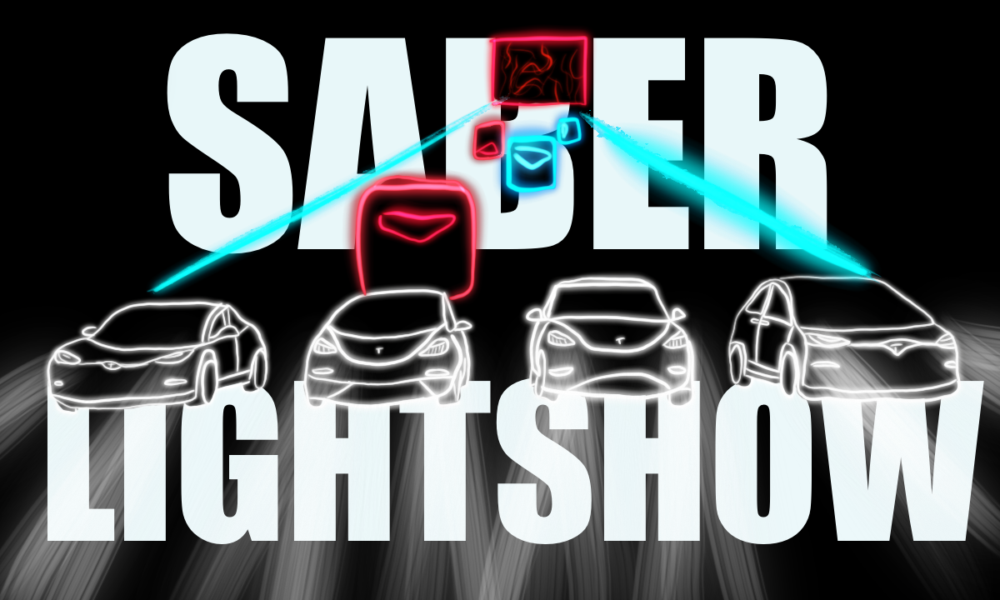

# SaberToTesla

Le poster du projet (réalisé par Constantin H.)

## Bachelor 2022
Le projert SaberToTesla est un projet regroupant la passion du jeu vidéo, des tesla et de l'informatique. Ce projet représente la fin de mes études de bachelor à la HEG. 

### Dates
Début : 11 avril 2022
Fin : 31 juillet 2022

Soutenance orale : 1 août 2022

## Principe
Ce projet est une application windows form C# ce reposant sur une API hébergée de manière privée. 
